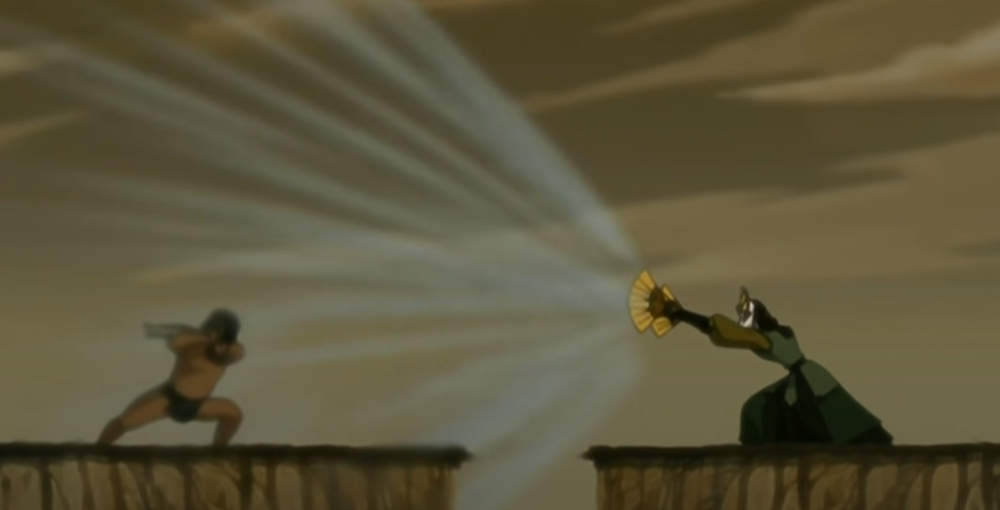
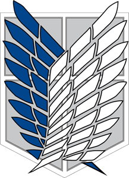

In this post, I will be trying how to add different media types etc. 

*starting with blog*

*no dots*

*one dot2*

*no dots2*

*"On that day we split from the mainland"*

*/images/ seklinde*

*./images/ seklinde*